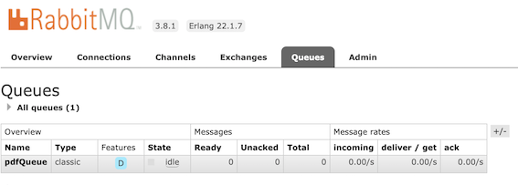

## Comparative of Background Tasks/Processes in Node.js + Express VS AWS Lambda
### Projects installation

<details>
<summary>Node.js + Express + RabbitMQ</summary>
<p>

### Requirements
- **Node.js** [Download](https://nodejs.org/es/download/)
- **POSTMAN** or your prefered way to do HTTP requests to an API [Get POSTMAN](https://www.getpostman.com/downloads/)
- **RabbitMQ** server. You can follow these steps to install it:
    1. Type this command on the terminal:<br>
        **Linux Systems**<br>
        ```
        sudo apt-get install rabbitmq-server
        ```

        **MacOS**<br>
        ```
        brew install rabbitmq
        ```

    2. Check the installation was correct typing:
        ```
        rabbitmq-server
        ```

        If everything is fine, you should see something like this:<br>

        ```
        ##  ##      RabbitMQ 3.8.1
        ##  ##
        ##########  Copyright (c) 2007-2019 Pivotal Software, Inc.
        ######  ##
        ##########  Licensed under the MPL 1.1. Website: https://rabbitmq.com

        Doc guides: https://rabbitmq.com/documentation.html
        Support:    https://rabbitmq.com/contact.html
        Tutorials:  https://rabbitmq.com/getstarted.html
        Monitoring: https://rabbitmq.com/monitoring.html

        Logs: /usr/local/var/log/rabbitmq/rabbit@localhost.log
                /usr/local/var/log/rabbitmq/rabbit@localhost_upgrade.log

        Config file(s): (none)

        Starting broker... completed with 6 plugins.
        ```

    3. To **access the UI** provided by RabbitMQ, you can **create an user** this way:
        ```
        rabbitmqctl add_user username userpass
        ```

    4. Then, you need to **make this user adminstrator**:
        ```
        rabbitmqctl set_user_tags username administrator
        ```

    5. **Access to this url** with the user credentials created above [http://localhost:15672](http://localhost:15672). This will be helpful if you want to see your queues in action!

### Installation

#### Node.js + express app installation
1. Clone the repository using the command line:

    ```
    git clone https://github.com/codeurjc-students/2019-ServerlessVsExpress.git
    ```

2. Navigate to the folder **sections -> BackgroundTasks -> nodejs-express-rabbitmq**.

3. Write the following command to install the project dependencies:

    ```
    npm install
    ```

4. Start Node.js + express server:

    ```
    npm start
    ```

#### Use
As we use to in the other sections, i've created and endpoint in the url [http://localhost:3000/generatePdf](http://localhost:3000/generatePdf). This endpoint, in the background, will **create a task**. This task will be added to a queue called **pdfQueue**, to be treated in the background. To create the request, you need to use **POST Method** with this body's content:

```json
{
	"pdfData": {
		"title": "mytitle",
		"content": "This is the pdf content"
	}
}
```

If everything is correct, the **pdf will be generated in a background process** (in your root folder). Queue status can be found in [http://localhost:15672/#/queues](http://localhost:15672/#/queues), where you'll be able to see a lot of information. Here, you can see an example:



---

</p>
</details>

<details>
<summary>AWS Lambda + S3 + SQS</summary>
<p>

### Requirements
- **Nodejs** [Download](https://nodejs.org/es/download/)
- A REST consumer app like **POSTMAN** [Download](https://www.getpostman.com/downloads/)
- **AWS SAM CLI** (You will need to have an **AWS account**). Follow these instructions to install it from the official docs: [Instructions](https://docs.aws.amazon.com/es_es/serverless-application-model/latest/developerguide/serverless-sam-cli-install.html)
- **AWS SDK for Javascript** Follow this two [Installation](https://aws.amazon.com/es/sdk-for-node-js/) steps to install it.

### Installation

#### AWS Lambda + S3 + SQS app installation
1. Clone the repository using the command line:

    ```
    git clone https://github.com/codeurjc-students/2019-ServerlessVsExpress.git
    ```

2. From the command line, navigate to the folder **sections -> BackgroundTasks -> aws-s3-sqs**
3. Type **npm install** from your command line to make sure you have the pdfkit module installed.
4. Type this to create a new bucket in your region:

    ```
    aws s3api create-bucket --bucket my-bucket --create-bucket-configuration LocationConstraint=eu-west-3
    ```
5. Login to the **AWS Console** and then, search [SQS section](https://console.aws.amazon.com/sqs/).
6. Choose **Create New Queue**. Select your desired region and type the **queue name** (we're using a standard queue). In our example, we called it "pdfQueue".
7. Open the file called **template.yaml** and in the resource named **PdfSqsQueue**, change its **QueueName** with your queue name.
8. In the same file, in the resource called **SQSQueueFunction**, replace **BucketName** attribute with your bucket name.
9. **Package the project** with SAM:

    ```
    sam package --template-file template.yaml --s3-bucket my-bucket --output-template-file packaged-template.yaml
    ```

10. **Deploy the project** to create the CloudFormation Stack in AWS:

    ```
    sam deploy --template-file packaged-template.yaml --stack-name background-tasks-stack --capabilities CAPABILITY_IAM
    ```
11. Go to the [queues section](console.aws.amazon.com/sqs/) in AWS Console, **select the queue pdfQueue** and press the button that says **Queue Actions**. Once it's opened, choose **Configure trigger for lambda function**.
12. The lambda function you have to click on, is the one that will be in charge of processing the messages, that should be called similar to **background-tasks-stack-SQSQueueFunction-XXXXXXXX**. This lambda, will be triggered each time that the queue has changed (received a message, deleted it, etc).
13. Keep inside your queues, and select pdfQueue, to look at the **Details** tab. Copy the **url** of the queue, and paste it in your **config/config.js** file where it says **pdfQueueUrl**. Inside this file, replace also the content of **pdfBucketName** with the name of your bucket.

### Use

For this section, we've created an **aws architecture** composed by an **Api** (with only one endpoint), a **SQS standard queue**, and a **S3 bucket**, where we'll deploy our stack and also upload the pdfs from the queue.

To make a request to the api, you first need to go to the AWS Console and then, to [API Gateway](https://aws.amazon.com/es/api-gateway/), and select your stack. There, you'll be able to see all the stages. Select **prod** stage, and you'll get the endpoints of our Api. Make sure to copy the url of the **/createPdf** endpoint. This is the body you need to perform a **POST request** to the Api:

Endpoint example: https://xxxxxxx.execute-api.eu-west-3.amazonaws.com/Prod/createPdf

Request Body:
```json
{
	"title": "This is a title",
	"content": "This is the content"
}
```

After making the request, you need to wait some seconds, before your message gets processed in the background. After that, if you go to your [S3 bucket](https://s3.console.aws.amazon.com/s3/buckets/) in AWS Console, inside the one you created before, you should see a folder called **/pdfs** which should contain a pdf file with the title and content you passed in the message.

---

</p>
</details>

## Comparative

### Node.js + Express + RabbitMQ - Background Tasks
There are many famous libraries to manage background tasks in Node.js. One of the most famous is **RabbitMQ**, which is the one i've chosen for this example (the callback version). The working flow RabbitMQ uses depends on two main entities, **exchanges** and **queues**. Queues are where the **messages are stored**, and at the same time, are **binded to an exchange**. They are both connected by a **"Route"**, which decides whether to move forward the message to a queue or not, depending on the type of the exchange.

Exchanges can be of **different types**:

- **direct**: The message goes to the queues whose binding key matches the key of the message.
- **topic**:  It's the same than a direct type, but it is used to broadcast a message.
- **headers**: It can be used when we need to filter with something more than a routing key, which could be better in some cases.
- **fanout**: This is the "hardest" type. It can be used when we need the message to be forwarded to all queues, and can also be used for broadcasting.

To import the **callback version of RabbitMQ**, write this on your app:

```javascript
const amqp = require('amqplib/callback_api');
```

Once you've imported the library, make sure your RabbitMQ server is running (write **rabbitmq-server** on the terminal if isn't). Then, you need to connect to the RabbitMQ server (we used localhost):

```javascript
amqp.connect('amqp://localhost', (err, conn) => {
    if(err) {
        console.error(err);
        process.exit(1);
    }
    consumer(conn);
    publisher(conn, req.body.pdfData);
});
```

Inside the connect, you can see two functions (**consumer** and **publisher**). We need them to create a **communication channel**, where we'll **add messages** to a queue using the publisher, and the consumer will **get the messages** from the queue (they must both connect to the channel) and **process** them. It will send an **ACK** with the original message as parameter to indicate that it was received properly, and then delete it from the queue.

Here, you can see the code of the **publisher**:

```javascript
const publisher = (conn, pdfData) => {
    const queue = 'pdfQueue';
    conn.createChannel((err, channel) => {
        if(err) {
            console.error(err);
            process.exit(1);
        }
        channel.assertQueue(queue, { durable: true });
        channel.sendToQueue(queue, Buffer.from(JSON.stringify(pdfData)), {persistent: true});
    });
};
```

You can also have a look at the **consumer** here:

```javascript
const consumer = (conn) => {
    const queue = 'pdfQueue';
    conn.createChannel((err, channel) => {
        if(err) {
            console.error(err);
            process.exit(1);
        }
        channel.assertQueue(queue, { durable: true }); // Durable: true makes the queue to persist even if connection has been closed
        channel.consume(queue, async (pdfData) => {
            try {
                let pdf = JSON.parse(pdfData.content.toString());
                let pdfGenerated = await generatePdf(pdf);
                if(pdfGenerated.error) {
                    console.log(pdfGenerated.error); 
                } else {
                    console.log(`The pdf has been generated in: ${pdfGenerated.response.filename}`);  
                }
                // Send back the ack to let it know that the bg task was completed
                channel.ack(pdfData);
            } catch(err) {
                console.log({error: err});
            }
             
        }, { noAck: false }); // This tells the server to not delete the message once it's delivered
    });
};
```

---

### AWS Lambda + S3 + SQS
In AWS, we have a great service called **SQS** (Simple Queue Service) which is great to **manage background tasks** by making use of message queues. SQS offers us **two types** of queues:

- **Standard:** This queue should be used when the order of the messages is not really important.
    - They have nearly **unlimited transactions per second**.
    - The order of the delivered messages might vary from the order they were sent.
    - A message is at least delivered once, but it can happen that a copy of the message is also delivered.

- **FIFO:** If you want the **same order when receiving the messages** than when they were sent, use this type of queue.
    - Order of the messages is preserved.
    - A message is at least delivered once. The **copies of the message are removed**.
    - The transactions per second are limited to 300.

Also, the messages in a queue have two possible status:

- **Messages Available:** When messages haven't been received by a consumer, they will be available.
- **Messages In flight:** Once messages have been received, but not deleted, they will be In Flight.

For this section, we have decided to use a Standard Queue. To use that queue, when we reach the endpoint mentioned above, we call the method publisher:

```javascript
await publisher({title: JSON.parse(event.body).title, content: JSON.parse(event.body).content});
```

There, we're sending the object that will be sent in a message to the queue. Let's comment what this method does:

First of all, we need to configure our **aws-sdk** and get the sqs object to use its functionality.

```javascript
const AWS = require('aws-sdk');
const { pdfQueueUrl } = require('./config/config');

// Set the region
AWS.config.update({region: 'eu-west-3'});

// Setting the API version we're going to use for SQS
const sqs = new AWS.SQS({
    apiVersion: '2012-11-05'
});
```

Then, we can use the sqs object to **send the message** with the content we provided, and indicating the url of our queue (you can find it in your [queue](console.aws.amazon.com/sqs/), looking at the details):

```javascript
const publisher = (pdfData) => {
    const params = {
        DelaySeconds: 15,
        MessageBody: JSON.stringify(pdfData),
        QueueUrl: pdfQueueUrl
    };

    return new Promise((resolve, reject) => {
        sqs.sendMessage(params, (err, data) => {
            if (err) {
                console.log("Error", err);
                reject(new Error(err));
            } else {
                console.log("Success", data.MessageId);
                resolve(`Success: ${data}`);
            }
        });
    });
};
```

With this, we have sent a message to the queue. Now, we need to **receive and process** it to get message's data and **upload** it to our S3 bucket. That's why we are **triggering a lambda function** called "queueProcessingHandler" when a message has been sent. The triggered lambda function will receive the message and process it:

```javascript
exports.queueProcessingHandler = async (event, context, callback) => {
    // When this lambda is triggered from the queue, it receives the message and deletes it if didn't happen any error.
    // In the background, it would be the same that doing sqs.receiveMessage(params, (err, res)) and sqs.deleteMessage(params, (err, res))
    // but the trigger does it automatically
    if(event.Records) {
        console.log("Consumer working...", event);
        let bodyPdfMessage = event.Records[0].body;
        try {
            await consumer(bodyPdfMessage);
            sendResponse(201, `The pdf has been created from the message.`, callback);
        } catch(err) {
            console.log(err);
            sendResponse(500, `Error creating from the message.`, callback);
        }
    }
    sendResponse(200, '', callback);
};
```

As it's indicated in the comments, when we trigger an event in a queue, it automatically receives and delete the message (if didn't happen any error). Our messages are inside the **Records object** attribute in the event. To create something that could match the version in node.js, we've created a **consumer**, but it's only used to **process the messages and upload them** to the bucket:

```javascript
const consumer = async (data) => {
    data = JSON.parse(data);
    return await generatePdf(data);
};

const generatePdf = (data) => {
    // Creating the pdf document with the data received in the message's body
    const pdfContent = new PDFDocument();
    pdfContent.fontSize(14);
    pdfContent.text(`${data.title}`);
    pdfContent.moveDown();
    pdfContent.fontSize(11);
    pdfContent.text(`${data.content}`);
    pdfContent.end();

    const params = {
        Key : `pdfs/pdf-${Date.now()}.pdf`,
        Body : pdfContent,
        Bucket : pdfBucketName
    };

    console.log(`Uploading pdf with name: ${params.Key}`);
    return S3.upload(params).promise();
};
```


### Summary
RabbitMQ has been easier to understand, and painless to configure. It provides more options, for example, to **move forward a message** in a queue, if it has preference (using the different types of exchanges), while AWS SQS doesn't allow this.

They way they work is almost the same. RabbitMQ uses a **channel** to provide communication when sending and receiving the messages, and in AWS SQS, you don't need to create the channel, but it seems to do it in the background for you (providing the queue url).

In addition, in RabbitMQ, we need to have the consumer always listening the channel. In AWS SQS, we can **configure or queue** to trigger an event that will only use the lambda function to receive the messages if a message has been sent.

AWS SQS also allows to configure a lot of params such as **DelaySeconds**, which tells the consumer to wait for n seconds before processing the message.

To finish with, both queue managers provide **User Interfaces** where we can check the queue messages and their status (and a lot more!).