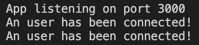
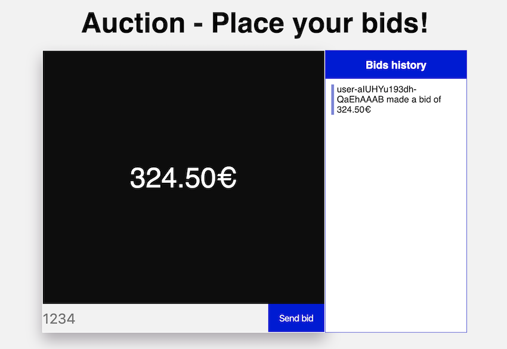
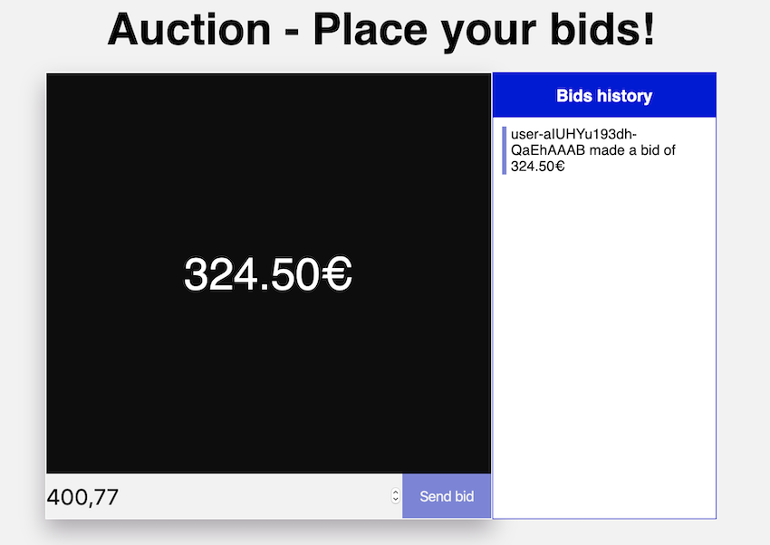
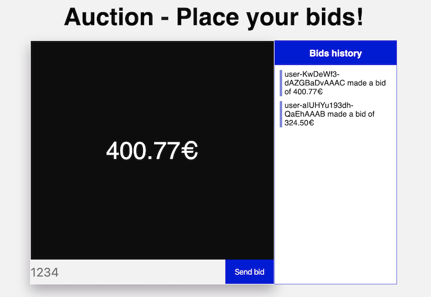
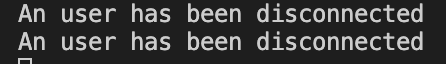

## Comparative between websockets in Node.js + Socket.io and AWS Lambda + API Gateway Websockets
### Projects installation
<details>
<summary>Node.js + Socket.io</summary>
<p>

### Requirements
- **Node.js** [Download](https://nodejs.org/es/download/)

### Node.js + Socket.io installation
1. Clone the repository using the command line:

    ```
    git clone https://github.com/codeurjc-students/2019-ServerlessVsExpress.git
    ```

2. From the command line, navigate to the folder **sections -> Notifications -> nodejs-socket-io**
3. Write the following command to **install the packages**, including socket.io:

    ```
    npm install
    ```

4. The last step is **running the server**:

    ```
    npm start
    ```

### Use
You can try this section using your browser. You just need to go to the url [http://localhost:3000](http://localhost:3000) after running the server. To be more realistic and simulate a **multiclient environment**, make sure to **open more than one browser window** with that url. A log should appear in your console everytime a new user/client connects to the server:



This project is an **auction simulator**, so, you should be able to **make a bid** from the different browser windows and the changes should be reflected in the rest of the windows. The changes can be seen in the **current max bid**, and the **bids history** on a right panel:

1. A first user makes a bid:



2. A second user sees changes reflected in his screen:



3. The second user makes a new bid, surpassing the first one, and also, gets added to the history:



4. When the users close the window, they disconnect from the server:



---

</p>
</details>

<details>
<summary>AWS Lambda + API Gateway Websockets</summary>
<p>

### Requirements
- **Nodejs** [Download](https://nodejs.org/es/download/)
- **AWS SAM CLI** (You will need to have an **AWS account**). Follow these instructions to install it from the official docs: [Instructions](https://docs.aws.amazon.com/es_es/serverless-application-model/latest/developerguide/serverless-sam-cli-install.html)
- **AWS SDK for Javascript** Follow this two [Installation](https://aws.amazon.com/es/sdk-for-node-js/) steps to install it.

### AWS + API Gateway Websockets installation
1. **Clone the repository** typing from your terminal:
    ```
    git clone https://github.com/codeurjc-students/2019-ServerlessVsExpress.git
    ```

2. Navigate to the folder **sections/Notifications/aws-api-gateway-sockets/** and type this command that will **create a bucket**, **package the SAM template** and **deploy** it to the bucket automatically (you can change the bucket name in the package.json file):
    ```
    npm run deploy-complete
    ```

3. Now, the Serverless architecture necessary to use websockets in AWS has been deployed to the cloud. Go to [console.aws.amazon.com/apigateway](console.aws.amazon.com/apigateway), and there choose the API **WebSocketApi**, which is the one we deployed.
4. On the left side, you'll see **Stages** section. Click on it and choose v1 stage. You'll need to copy the **Websocket URL** that will allow us to connect from the client side. It should be something like **wss://xxxxxxx.execute-api.eu-west-3.amazonaws.com/v1**.
5. Go to the folder **sections/Notifications/aws-api-gateway-sockets-client/**. Open the **views/index.html** file and change the line 41 with your Websocket URL (the one you copied in the step above):
    ```javascript
    let Socket = new WebSocket("wss://xxxxxxxxxx.execute-api.eu-west-3.amazonaws.com/v1", []);
    ```

6. We are almost done. The last step is running the server that will start our client. Type the following:
    ```
    npm start
    ```

### Use
To use this app, you can navigate from your browser to [http://localhost:4000](http://localhost:4000/). **Open another window/tab** with the same url (simulating a second user). Now, if you place a bid in one of the windows, this message **should appear also in the other one** without reloading the browser. The same would happen if you place a bid from the second window. The examples, visually, are the same than in the Node.js version (which you can see reading above in its documentation).

---

</p>
</details>

## Comparative

### Node.js + Socket.io
Socket.io is composed by two parts:
- A **server** that mounts on the **Node.js HTTP server** ([socket.io](https://github.com/socketio/socket.io)).
- A **client** that communicates with the server and loads in the browser side: ([socket.io-client](https://github.com/socketio/socket.io-client)).

#### Server side:
Socket.io needs an initialized instance to work. You can do that by passing the http server object in the require:

```javascript
const app = express();
const http = require('http').createServer(app);
const io = require('socket.io')(http);
```

Once we have the io object initialized, we can use io methods, for example, to listen for user connections:

```javascript
io.on('connection', (socket) => {
    console.log('User connected');
});
```

After that, we would have a socket object, which is, indeed the connection between the user and the server. This allows us to, for example, listen for a type of event from the client, which would include a JSON object containing the data:

```javascript
socket.on('incoming bid', (msg) => {
    console.log(JSON.stringify(msg));
});
```

There also exist **reserved events**, which are useful to control typical scenarios. To give you an example, we could know when an user has been disconnected:

```javascript
socket.on('disconnect', () => {
    console.log(`User ${socket.id} has been disconnected`);
});
```

But, what if we want to create a broadcast event to spread information to all the clients? Socket.io didn't forget about that, and let us do it by using the **emit** method:

```javascript
if(parseFloat(msg.amount) > parseFloat(currentBidAmount)) {
    currentBidAmount = msg.amount;
    // Broadcast the message to all the users connected
    io.emit('bid history', msg);
}
```

#### Client side:
On the client side, we can import the client socket.io version like this, in the html template (right before the "closing body" tag):

```html
    <!-- Rest of the html -->
    <script src="/socket.io/socket.io.js"></script>
</body>
```

Then, we need do create the **io object** to send events and listen them from the server side:

```html
<script>
    let socket = io();
</script>
```

To **send events** to the server, which is listening all the time to its connected clients by using sockets, we can use also the **emit event** from the io object:

```javascript
if(bid_amount !== "")
    socket.emit('incoming bid', {amount: bid_amount});
```

### AWS Lambda + AWS API Gateway Websockets
AWS has recently launched its websockets service, under the name of **API Gateway V2**. Indeed, you can almost do the same things than we did with Socket.IO, but it isn't easy to achieve that in just a few steps. To begin with, in order to use these websockets, you must make use of Lambda functions, a DynamoDB table which will be where we'll store the connection ids and some more.

#### Server side:

API Gateway V2 provides us with **3 default key routes**, which are:

- **$connect**: The route used when a new client joins the connection.
- **$disconnect**: When a user leaves the connection, this route is used.
- **$default**: When a client tries to use a non-defined route in our websockets api, it is redirected to this route.

If we want to use a custom route, we can do it, but we must specify it in our architecture (in SAM template.yaml). For example, if we want a **new key route** to send a message, we could add it this way:

```yaml
OnMessageRoute:
    Type: AWS::ApiGatewayV2::Route
    Properties:
      ApiId: !Ref WebSocketApi
      RouteKey: "onMessage"
      AuthorizationType: NONE
      OperationName: OnMessageRoute
      Target: !Join
        - '/'
        - - 'integrations'
          - !Ref OnMessageIntegration
```

Also, everytime you define a route, you should also **create its integration**, which will be the one in charge of **triggering the lambda function**:

```yaml
# Integration of the Route to onMessage
  OnMessageIntegration:
    Type: AWS::ApiGatewayV2::Integration
    Properties:
      ApiId: !Ref WebSocketApi
      Description: OnMessage integration
      IntegrationType: AWS_PROXY
      IntegrationUri: 
        Fn::Sub:
            arn:aws:apigateway:${AWS::Region}:lambda:path/2015-03-31/functions/${OnMessageLambdaFunction.Arn}/invocations
```

In order to give permissions to this new route, we must create a **Lambda permission**:

```yaml
OnMessagePermission:
    Type: AWS::Lambda::Permission
    DependsOn:
      - WebSocketApi
      - OnMessageLambdaFunction
    Properties:
      Action: lambda:InvokeFunction
      FunctionName: !Ref OnMessageLambdaFunction
      Principal: apigateway.amazonaws.com
```

Also, we must **deploy our Websockets Api** and **set a stage**, indicating the routes in the deploying:

```yaml
# Deployment of the websockets API
  Deployment:
    Type: AWS::ApiGatewayV2::Deployment
    DependsOn:
      - ConnectRoute
      - DisconnectRoute
      - OnMessageRoute
    Properties:
      ApiId: !Ref WebSocketApi

  Stage:
    Type: AWS::ApiGatewayV2::Stage
    Properties:
      StageName: v1
      Description: First version of the websockets api
      DeploymentId: !Ref Deployment
      ApiId: !Ref WebSocketApi
```

The Websocket Api that is being used by all these routes, should have the form:

```yaml
# Creates an api resource to use websockets
  WebSocketApi:
    Type: AWS::ApiGatewayV2::Api
    Properties:
      Name: WebSocketApi
      ProtocolType: WEBSOCKET
      RouteSelectionExpression: "$request.body.action"
```

That means, the onMessage calls to the websocket should have the form:

```json
{
    "action": "onMessage",
    "data": {
        // data object
    }
}
```

In addition, to **store the connected clients**, we save in a DynamoDB table their connectionIds everytime a new client connects, and delete them when they disconnect. Doing it this way, we can **broadcast a message** to all the clients connected. You can see the DynamoDB table resource here:

```yaml
# Creates a dynamodb table to save the connection ids
  WebsocketsTable:
    Type: 'AWS::DynamoDB::Table'
    Properties:
        TableName: websockets-table
        AttributeDefinitions:
            -   AttributeName: connectionid
                AttributeType: S
        KeySchema:
            -   AttributeName: connectionid
                KeyType: HASH
        ProvisionedThroughput:
            ReadCapacityUnits: 5
            WriteCapacityUnits: 5
```

When a new client **connects to the websocket**, we need to insert its connection id in the table:

```javascript
exports.handlerConnect = async (event, context, callback) => {
    const { connectionId } = event.requestContext;

    try {
        let res = await addConnectionDB(connectionId);
        //...
    } catch(err) {
        //...
    }
};

const addConnectionDB = (connectionId) => {
    const params = {
        TableName: TABLE_NAME,
        Item: {
            "connectionid": connectionId
        }
    };

    return dbb.put(params).promise();
};
```

When the client **disconnects**, we just remove its connectionid:

```javascript
exports.handlerDisconnect = async (event, context, callback) => {
    const { connectionId } = event.requestContext;

    try {
        let res = await deleteConnectionDB(connectionId);
        //...
    } catch(err) {
        //...
    }   
};

const deleteConnectionDB = (connectionId) => {
    const params = {
        TableName: TABLE_NAME,
        Key: {
            "connectionid": connectionId
        }
    };

    return dbb.delete(params).promise();
};
```

To **broadcast a message**, we can, for example, scan our DynamoDB table to get the connectionid of every client and send them one by one the message. You can see how this would look here:

```javascript
exports.handlerOnMessage = async (event, context, callback) => {  
    try {
        let res = await emitMessage(event);
        //...
    } catch(err) {
        //...
    }
};

const emitMessage = async (event) => {
    let posted;
    try {
        const connectedIds = await getAllConnectedIds();
        posted = connectedIds.Items.map(async (item) => {
            try {
                await sendMessage(event, item.connectionid);
            } catch(error) {
                console.log(error);
            }
        });
    } catch(err) {
        console.log(err);
    }

    try {
        return Promise.all(posted);
    } catch(err) {
        console.log(err);
    }
};

const getAllConnectedIds = () => {
    const params = {
        TableName: TABLE_NAME,
        ProjectionExpression: 'connectionid'
    };

    return dbb.scan(params).promise();
};

const sendMessage = (event, connectionId) => {
    const body = JSON.parse(event.body);
    const data = body.data;
    const { domainName, stage } = event.requestContext;
    const endpoint = `${domainName}/${stage}`;

    const apigwManagementApi = new AWS.ApiGatewayManagementApi({
        apiVersion: '2018-11-29',
        endpoint: endpoint
    });

    const params = {
        ConnectionId: connectionId,
        Data: JSON.stringify(data)
    };

    return apigwManagementApi.postToConnection(params).promise();
};
```

There are more lines of code where you can see how it's possible to create routes, integrations, and the lambda of the default routes ($connect and $disconnect). To check them, just look at the code in **../aws-api-gateway-websockets/template.yaml**.

#### Client side:
On the client side, we have almost the same code we did for the Node.js version (because we are trying to acomplish the same results, i thought it would be a good idea to have the same frontend/style). In this case, i used "common Websockets", without any libraries.

To connect to the websocket, we need to get the **Websocket URL** (in the installation steps, we explain how to do that) and use it as a parameter to create the object:

```javascript
let Socket = new WebSocket("wss://xxxxxxxxxx.execute-api.eu-west-3.amazonaws.com/v1", []);
```

Once we have the Websocket object, we can make a **broadcast** calling the action "onMessage", which was specified in the server side (OnMessageRoute in the template.yaml):

```javascript
Socket.send(JSON.stringify({
    action: "onMessage", 
    data: {
        connection_id,
        bid_amount: bid_amount
    }
}));
```

To **listen the incoming messages**, Websockets allow us to use the method "onmessage", where we could get all the data:

```javascript
Socket.onmessage = (evt) => {
    let data = JSON.parse(evt.data);
    let li = document.createElement('li');
    li.appendChild(document.createTextNode(`${data.connection_id} made a bid of ${data.bid_amount}€`));
    bids_list.insertBefore(li, bids_list.firstChild);
    current_max_bid.textContent = `${data.bid_amount}€`;
};
```

### Summary
In this section, i think the winner would be the app done with node.js + Socket.io. It was way too easy to create the application in comparation with the AWS Websockets. In my opinion, as the AWS Websockets were **released recently**, there are many things which should be improved. I think that if i'm going to use websockets, i shouldn`t have to implement all the steps of saving the connections into a Database, creating all the proccesses of inserting, deleting, etc. Of course, with this opinion, i'm not saying that they are less powerful than their competitors, but just the way to **achieve the same results**.