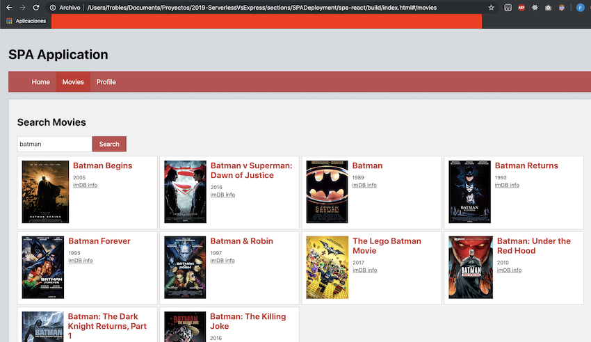
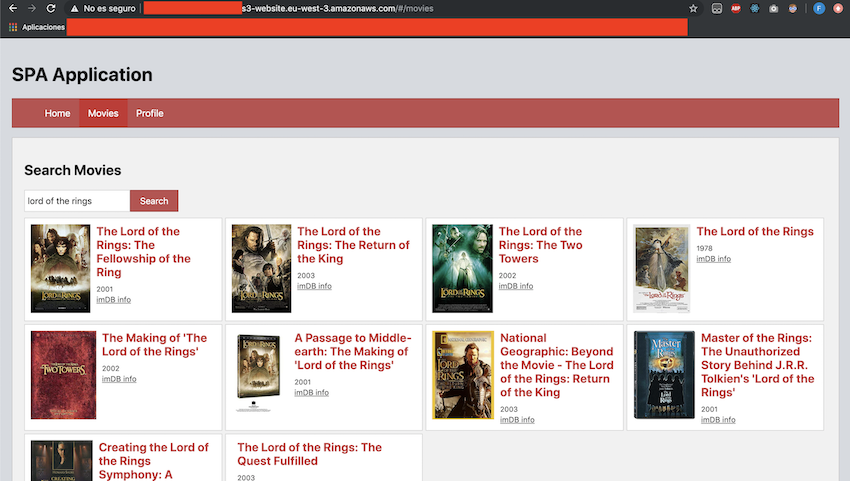

## Deployment of a SPA (Single Page Application) in a Non-Serverless environment VS a Serverless (AWS S3 bucket)

### Common requirements
- **Node.js** [Download](https://nodejs.org/es/download/)
- An **API key** to use the **OMDB** movies and series API. You can get one for free here [Get a free API key](http://www.omdbapi.com/) (with 1000 request/day)
- Your favorite IDE/editor

### Installation (the same in both cases)
1. Clone the repository using the command line:

    ```
    git clone https://github.com/codeurjc-students/2019-ServerlessVsExpress.git
    ```

2. From the command line, navigate to the folder **setions -> SPADeployment -> spa-react**

3. Write the following command to install the necessary dependencies:

    ```
    npm install
    ```
4. Change the **OMDB API key** to use yours. You can do that by changing the variable called **const API_KEY = "YOUR_KEY"** with the one you got.

### Deployment (Using a SPA with React)

<details>
<summary>Non-Serverless</summary>
<p>

### Requirements

- A typical server to host our SPA static files (It could be, for example, Apache). In this case, as static files can be interpreted by a browser, we don't really need a server to see the app working. We will do it locally.

### Deployment

To deploy our app locally, we first need to build or project. This will create **chunks** of code (using hashes by name), which will be the same code our project contains, but obfuscated to avoid security problems and hide important data. To build our app, we need to write in the command line (from the root folder of our project):

```
npm run build
```

After doing the step above, a **build** folder will be created. This is all the static code we need to upload to the server. In this case, we have chosen to "deploy" it locally, but you'd just need to upload it with your favorite **FTP** app (for example, Filezilla) to the /html folder.

If we now go to the build/ folder and open the **index.html file** with your browser, you should be able to see the project working!

Here, you can see the working example:



</p>
</details>

<details>
<summary>Serverless (AWS S3 bucket)</summary>
<p>

### Requirements

- An **AWS account** [Create one for free](https://aws.amazon.com)
- An **AWS IAM user** [Documentation to create an IAM user](https://docs.aws.amazon.com/en_en/IAM/latest/UserGuide/id_users_create.html)
- **AWS CLI** installed and configured with valid credentials [Install AWS CLI](https://docs.aws.amazon.com/en_en/cli/latest/userguide/cli-chap-welcome.html)

### Deployment

To deploy our SPA using an AWS S3 bucket, we need to create the bucket with the right policies/configuration. Let's see how to do that step by step:

1. Sign in to the **AWS Console** [Console](https://aws.amazon.com/en/console/) and **write S3 in the search box**. Click on it to enter this service.
2. Press the button **Create a bucket**.
3. Write the bucket name you want (it needs to be unique), in this case, i wrote **franrobles8-spa-bucket**. Then, choose your prefered region you want your bucket to be and press **next**.
4. In this case, you can skip the **Configure options**, so, press **next** again.
5. Uncheck the checkbox that says **Block all public access**. This will allow the bucket to serve the objects of our SPA to everyone. Press **next**.
6. Click on **Create bucket**.

At this point, our bucket should be created, but we need some more steps to configure it:

1. Click on the name of your bucket.
2. Click on the **properties** tab.
3. Select the option that says **Static website hosting**. Enter the entry point and the error in the fields. For our example, index.html and index.html (both the same). Click **Save**.

We have told our bucket to set up as a hosting, but now, let's set the permissions:

1. Click the **Permissions** tab.
2. Select **Bucket Policy**.
3. Write a new policy with this content (don't forget to change **your-bucket-name** with the name you chose for your bucket). This will allow users to read from your bucket:

    ```json
    {
        "Version": "2012-10-17",
        "Statement": [
            {
                "Sid": "AllowPublicReadAccess",
                "Effect": "Allow",
                "Principal": "*",
                "Action": [
                    "s3:GetObject"
                ],
                "Resource": [
                    "arn:aws:s3:::your-bucket-name/*"
                ]
            }
        ]
    }
    ```

It's time to **deploy**! I've done a little change to the **package.json** file. In the **scripts section**, i added a line to be able to deploy my SPA files directly to the created bucket:

```json
"scripts": {
    //...
    "deploy-aws": "aws s3 sync build/ s3://franrobles8-spa-bucket --acl public-read"
}
```

You just need to change the bucket name **franrobles8-spa-bucket** with your correct bucket name. After doing that, you can build and deploy in one line as follows (from the root project's folder):

```
npm run build && npm run deploy-aws
```

Now, you need to go to your **S3 bucket** in the AWS Console and copy the **URL** provided in the **Static Web Hosting** modal. Paste it in your prefered browser and see how it works!

Here, you can see the working example:



</p>
</details>

## Comparative between deployments

The SPA's deployment in a **local/common server** is really simple. You just need to build the app with one command line, which will get the **chuncked code** and then upload it to your server by FTP. If you have followed the steps above, you should be able to see the running app from your browser.

To deploy it to an AWS S3 bucket, you need more requirements. This is, indeed, the **"hard part"** of this kind of deployment. Once you have completed them, the deployment is really easy. You'd just need to build the project as you do it normally, but then, you must synchronize your local build folder with the cloud bucket, using **aws s3 sync build/ s3://your-bucket-name --acl public-read**. The **--acl** flag is needed in last versions to allow users to access all the app in our bucket (by default, AWS S3 keep files private).

As you can see, both deployments are **really easy**. The last one is a bit more complicated, but you just need to acomplish the requirements once. The rest of the times, it'll become a ride in the park!